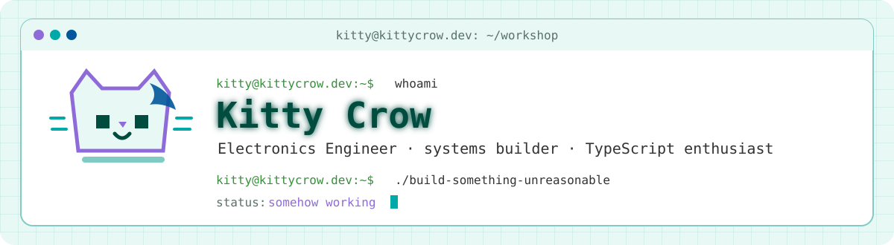
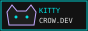
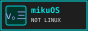
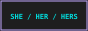
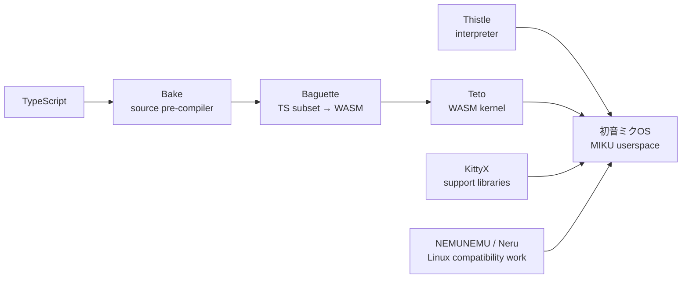

<div align="center">

<picture>
  <source media="(prefers-color-scheme: dark)" srcset="./assets/banner-dark.svg">
  <source media="(prefers-color-scheme: light)" srcset="./assets/banner-light.svg">
  
</picture>

<br>

[](https://kittycrow.dev)
[](https://kittycrow.dev/blog)
[](mailto:kitty@kittycrow.dev)
[](https://ko-fi.com/kittycrow)

</div>

## Hello, everynyan `(=^ΦωΦ^=)`

I’m **Kitty Crow**, an Electronics Engineer living in Scotland, originally from South America.

At work, I live around telemetry, instrumentation, systems integration, test equipment, and the awkward boundary where hardware and software stop agreeing. Outside work, I make TypeScript do things it was probably not emotionally prepared for: compilers, WebAssembly kernels, browser tools, a tiny operating system, and whatever else began with *“this should be simple”*.

> I build things, break them, read the logs, and build them again.

My website is part workshop, part scrapbook. It is where engineering notes sit beside strange little tools, retro-web experiments, terminal windows, fiction, anime catgirls, and projects that got completely out of hand. I am not sanding it down for LinkedIn.

<p align="center">
  <a href="https://kittycrow.dev"></a>
  <a href="https://github.com/kitty-crow/mikuOS"></a>
  <a href="https://www.typescriptlang.org/"></a>
</p>

## Compatibility notes

<p align="center">
  
  
  
  
  
  
</p>

<div align="center">

</div>

## What is on the workbench

<table>
<tr>
<td width="50%" valign="top">

### [初音ミクOS v｡三](https://github.com/kitty-crow/mikuOS)

An experimental non-Linux operating system and userspace. **MIKU** means *MIKU Is Not the Kernel; it’s Userspace*. It can boot through the Thistle interpreter or the Teto WebAssembly kernel, with a growing Unix-like userland and browser build.

`TypeScript` `WebAssembly` `RISC-V` `systems`

</td>
<td width="50%" valign="top">

### [Sandsara Track Viewer](https://github.com/kitty-crow/sandsara-track-viewer)

A Visual Studio Code extension and local browser studio for kinetic sand tables. It turns images and SVGs into continuous, route-planned binary tracks, previews them live, and keeps the whole pipeline on the user’s machine.

`TypeScript` `VS Code` `Web Workers` `WASM`

</td>
</tr>
<tr>
<td width="50%" valign="top">

### [Braille QR](https://github.com/kitty-crow/braille-qr)

A strongly typed utility that renders genuine QR matrices as dense Unicode Braille for terminals, self-contained HTML pages, browser generation, and paste-ready embeds.

`TypeScript` `Unicode` `QR` `terminal`

</td>
<td width="50%" valign="top">

### [The toolchain rabbit hole](https://github.com/kitty-crow/baguette)

**Bake** reshapes TypeScript into the subset understood by **Baguette**, Baguette compiles it towards WebAssembly, **Thistle** interprets the instruction set, and **Teto** executes it as a kernel. This was once a small compiler project.

`compiler` `runtime` `kernel` `because why not`

</td>
</tr>
</table>

<details>
<summary><strong>Open the unnecessarily detailed version</strong></summary>



The names are recursive acronyms because apparently the technical problem was not enough.

</details>

## Tools I reach for

<p align="center">
  
  
  
  
  
  
  
  
  
  
</p>

```ts
const kitty = {
  work: ["telemetry", "instrumentation", "systems integration"],
  afterHours: ["compilers", "kernels", "browser tools", "odd ideas"],
  defaults: {
    language: "TypeScript",
    platform: "Linux",
    approach: "make it work, understand why, then make it clean"
  },
  status: "probably debugging something"
} as const;
```

## Workshop telemetry

<div align="center">
  <picture>
    <source media="(prefers-color-scheme: dark)" srcset="https://raw.githubusercontent.com/kitty-crow/kitty-crow/output/stats-dark.svg">
    <source media="(prefers-color-scheme: light)" srcset="https://raw.githubusercontent.com/kitty-crow/kitty-crow/output/stats-light.svg">
    
  </picture>
  <picture>
    <source media="(prefers-color-scheme: dark)" srcset="https://raw.githubusercontent.com/kitty-crow/kitty-crow/output/langs-dark.svg">
    <source media="(prefers-color-scheme: light)" srcset="https://raw.githubusercontent.com/kitty-crow/kitty-crow/output/langs-light.svg">
    
  </picture>
</div>

<br>

<div align="center">
  <picture>
    <source media="(prefers-color-scheme: dark)" srcset="https://raw.githubusercontent.com/kitty-crow/kitty-crow/output/contrib-dark.svg">
    <source media="(prefers-color-scheme: light)" srcset="https://raw.githubusercontent.com/kitty-crow/kitty-crow/output/contrib-light.svg">
    
  </picture>
</div>

## Find me around the webz

<p align="center">
  <a href="https://kittycrow.dev">website</a>
  ·
  <a href="https://kittycrow.dev/blog">blog</a>
  ·
  <a href="https://kittycrow.dev/guestbook">guestbook</a>
  ·
  <a href="https://github.com/kittyCrypto-gg">web projects</a>
  ·
  <a href="https://discord.com/users/kitty.crow">Discord</a>
  ·
  <a href="https://twitter.com/kitty_cr0w0">Twitter</a>
  ·
  <a href="https://t.me/kitty_crow">Telegram</a>
</p>

<div align="center">

`ฅ^•ﻌ•^ฅ`  
**Thanks for wandering through.**

</div>
